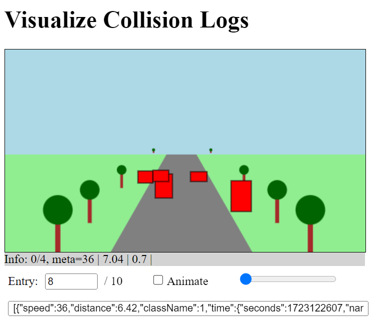

# VizCollisionLogs
Visualize Collision Logs

<ul>
  <li><b>VizFCWAlert.html</b> : main file to load, process and display the alert logs as image/animation.</li>
  <li><b>allAlerts.js</b> : list of alert meta data (utilized by main code), needs to be generated separately</li>
</ul>

<b>Example Output:</b> 

